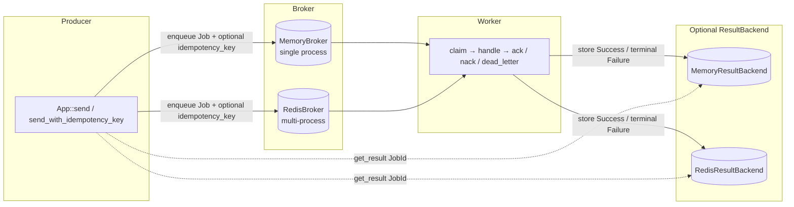
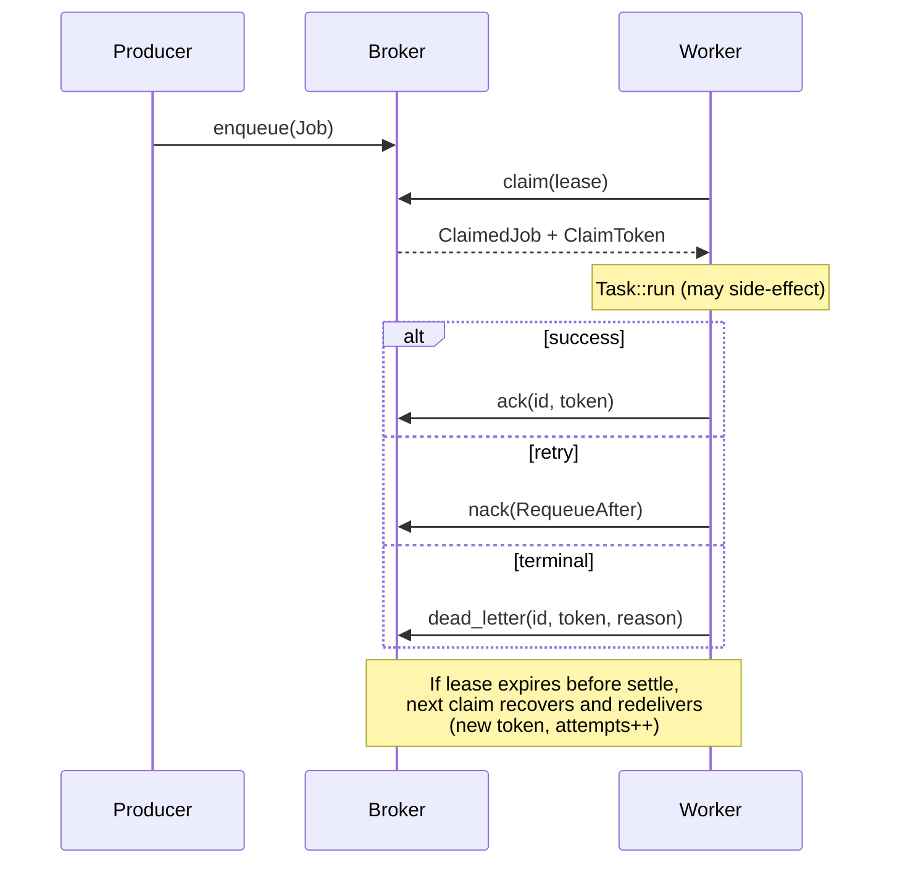

# Architecture

High-level topology and component map for **capivara** (M0–M3). Delivery promises live in
[guarantees.md](guarantees.md); this file is the structural map.

---

## Topology

Celery-like *system shape*, not Celery protocol interop:

```text
register Task types → send::<T>(&args) → Broker → Worker → optional ResultBackend
```



**Backends are pluggable behind traits** (`Broker`, `ResultBackend`). Today:

| Role | In-process (default) | Multi-process (`redis` feature) |
|---|---|---|
| Queue / lease / DLQ | `MemoryBroker` | `RedisBroker` |
| Optional results | `MemoryResultBackend` | `RedisResultBackend` |

- **Memory** is for tests and single-process apps — not shared across OS processes.
- **Redis** shares the same `RedisConfig` (`url` + `prefix`) between producer and worker.
- Omitting a result backend is intentional **fire-and-forget** (`get_result` → `NoResultBackend`).

---

## Components

```text
src/
  app.rs       App: register, send, run_worker, get_result, policy knobs
  task.rs      Task trait (NAME, Args, Output, async run)
  registry.rs  name → handler map
  job.rs       Job, JobId, QueueName
  broker/      Broker trait + Memory + optional Redis
  result/      ResultBackend trait + Memory + optional Redis
  worker/      claim loop, concurrency semaphore, settle paths
  retry.rs     RetryPolicy (exponential + equal jitter)
  metrics.rs   metrics facade helpers (always available)
  metrics_http.rs  optional scrape server (`metrics-http` feature)
```

| Piece | Responsibility |
|---|---|
| **`App`** | Facade: owns broker, optional result backend, registry, lease / concurrency / retry policy |
| **`Task`** | Typed unit of work; JSON serde for args/output; native async `run` |
| **`Broker`** | `enqueue`, `claim` (lease + recover-on-claim), `ack` / `nack` / `dead_letter`, `list_dead` |
| **`ClaimToken`** | Opaque token per claim; late settle cannot steal a reclaimed job |
| **`Worker`** | Concurrent drain: claim → run (panic-isolated) → store? → settle |
| **`ResultBackend`** | Best-effort visibility of Success / terminal Failure by `JobId` |
| **`RetryPolicy`** | Shared nack delay schedule; `max_attempts` before DLQ |

Worker settle summary (see [guarantees.md](guarantees.md) for full rules):

| Handler outcome | Settle | Result (if backend) | Metrics `status` |
|---|---|---|---|
| `Ok` | `ack` | `Success` (then ack) | `success` |
| Err/panic, attempts &lt; max | `nack(RequeueAfter)` | **none** (`ResultNotFound`) | `failure` |
| Err/panic, attempts ≥ max | `dead_letter` | `Failure` only if ownership held | `dead` |
| Unknown task name | `dead_letter` | `Failure` only if ownership held | `dead` |
| Lost lease on settle | non-fatal | no Failure write | **no** completion counter |

---

## Claim, lease, redelivery



Implications (honest defaults):

- Delivery is **at-least-once**, not exactly-once.
- Handlers should be **idempotent**.
- Producer `idempotency_key` de-dupes **enqueue**, not worker redelivery.
- Result store is **not** a two-phase commit (Success-then-ack can rewrite after crash).

---

## Observability surfaces

Library emits only; the host process installs exporters.

| Surface | Feature / dep | What you get |
|---|---|---|
| **Tracing spans** | always-on `tracing` facade | `capivara.enqueue`, `claim`, `handle`, `ack`, `nack`, `dead_letter`, `get_result` |
| **Metrics** | always-on `metrics` facade | enqueued / completed / duration / claim wait / queue depth |
| **Scrape HTTP** | opt-in `metrics-http` | Prometheus text on `127.0.0.1:9090` by default |

`capivara_jobs_completed_total{status=...}`:

- `success` — acked after handler success
- `failure` — nacked for **retry** (not terminal)
- `dead` — dead-lettered (terminal)

Lost-lease races do **not** increment completion counters (ownership not confirmed).

App wiring snippets: README [Observability](../README.md#observability).

---

## Explicit non-goals (current milestones)

- Celery wire protocol, pickle, shipping functions over the wire
- Exactly-once execution end-to-end
- DLQ automatic redrive / replay API
- Cross-process Memory broker
- crates.io publish while `publish = false` (discuss **0.1.0** with the maintainer after M3)

When topology or guarantees change, update this file, [guarantees.md](guarantees.md), and the README together.
